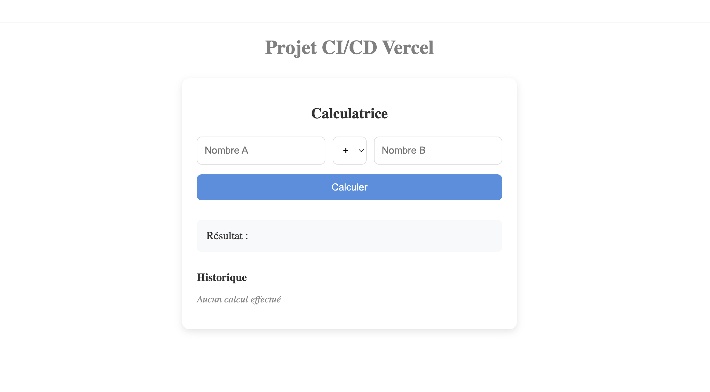
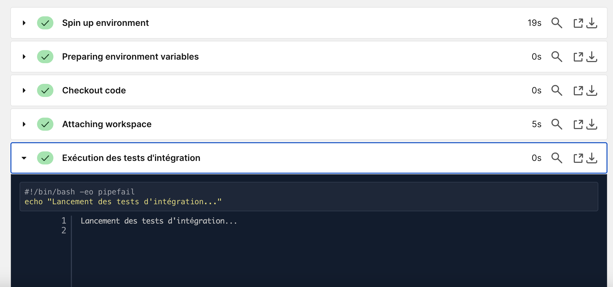

# 📘 Documentation Technique - CI/CD avec CircleCI & Vercel



## 🚀 Introduction
Ce projet est configuré avec **CircleCI** pour assurer l'intégration et le déploiement continus d'une application **Next.js**. Le pipeline effectue des vérifications de code, des tests automatisés et un déploiement final sur **Vercel**.

---

## 🏗️ Gestion des Branches
Le projet suit la méthodologie **GitFlow**, avec une structure claire :

- **develop** : Branche de développement utilisée pour intégrer les nouvelles fonctionnalités.
- **integration** : Environnement de test pour valider les modifications avant production.
- **main** : Branche principale, contenant la version stable en production.
- **feature/*** : Branches temporaires pour le développement de nouvelles fonctionnalités. **(supprimées après merge)**
- **hotfix/*** : Branches dédiées aux corrections urgentes en production. **(supprimées après merge)**

---

## 🔄 Workflow CI/CD

### 🛠 Étapes du pipeline
Le fichier `.circleci/config.yml` définit plusieurs étapes pour automatiser le cycle de vie du projet :

#### **Stage 1: Build**
1. **Installation des dépendances** (`initialisation`)
2. **Analyse statique du code** (`validation_code`)
3. **Compilation du projet** (`construction_projet`)
4. **Nettoyage et packaging** (`cleaning_packaging`)

#### **Stage 2: Tests**
5. **Tests unitaires** (`tests_unitaires`)
6. **Tests d'intégration** (`tests_integration`)
7. **Tests de régression** (`tests_regression`)
8. **Tests de performance** (`tests_performance`)
9. **Tests de sécurité** (`tests_securite`)
10. **Tests de compatibilité** (`tests_compatibilite`)
11. **Tests d'accessibilité** (`tests_accessibilite`)
12. **Tests de charge** (`tests_charge`)

#### **Stage 3: Déploiement**
13. **Génération de version** (`generation_version`)
14. **Préparation du déploiement** (`preparation_deploiement`)
15. **Déploiement sur Vercel** (`deploiement_vercel_production`)
16. **Vérification après déploiement** (`verification_post_deploiement`)
17. **Surveillance post-déploiement** (`surveillance_post_deploiement_production`)
18. **Nettoyage des branches feature/hotfix après merge** (`cleanup_branches`)

Chaque job est conditionné pour garantir un enchaînement logique et optimiser les performances.

### 🔍 Conditions d’exécution
- Les tests et le build sont exécutés sur toutes les branches.
- Le déploiement sur **Vercel** se déclenche uniquement lors de modifications sur la branche **main**.
- Les branches **feature/*** et **hotfix/*** sont automatiquement supprimées après leur merge dans `main`.

---

## ⚙️ Configuration CircleCI

### 📁 Fichier `.circleci/config.yml`
Le fichier de configuration se trouve à la racine du projet, dans le dossier `.circleci/`. Il définit :

- L’exécution des jobs dans un environnement **Node.js**.
- L’utilisation de **Vercel CLI** pour le déploiement.
- L’enchaînement des étapes en fonction des dépendances et des branches concernées.
- Un mécanisme de suppression automatique des branches `feature/*` et `hotfix/*` après leur fusion.

### 🔑 Variables d’environnement
Pour garantir le bon fonctionnement du déploiement, les variables suivantes doivent être définies dans CircleCI :

| Nom de la Variable | Description |
|--------------------|-------------|
| `VERCEL_TOKEN` | Jeton d’authentification Vercel |

La variable a été ajoutée dans **Project Settings > Environment Variables** sur CircleCI.

---

## 🚀 Déploiement sur Vercel
L’application est déployée automatiquement sur **Vercel** à chaque mise à jour de la branche **main**.

Si nécessaire, le déploiement peut être déclenché manuellement avec la commande suivante :

```bash
vercel --prod --token $VERCEL_TOKEN
```

---

## 📸 Suivi des Pipelines
### ✅ **Pipeline réussi sur `develop`**
_Exécution du pipeline après un push sur `develop`, avec succès des tests d'intégration (et du reste)._

[](https://www.youtube.com/watch?v=57U_apVG0rc)



### ✅ **Pipeline réussi sur `main`**
_Exécution du pipeline après un push sur `main`, déclenchant le déploiement sur Vercel._

[](https://www.youtube.com/watch?v=Fk72kAiEsvI)

---

## 🔗 Référentiel GitHub & Projet hébergé
Retrouvez le projet et son fichier de configuration **CircleCI** ici :
👉 [GitHub Repository](https://github.com/cristelleal/test_indus_next)

Retrouvez le projet hébergé sur **Vercel** ici :
👉 [Lien Vercel](https://testindusnext.vercel.app/)

🚀 **Projet développé par Cristelle Almodar**